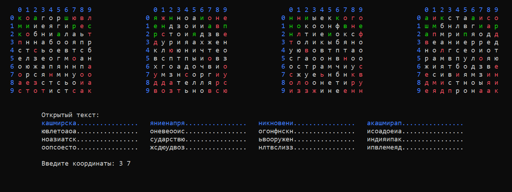

# Cardan Cipher



Проект предназначен для удобного начитывания открытого текста по шифртексту, полученному при помощи шифра [Кардано](https://en.wikipedia.org/wiki/Cardan_grille).

## Building

Для компиляции пректа необходима система сборки CMake версии не ниже 3.19.2, которую можно скачать на [официальном сайте](https://cmake.org/).
```shell
> mkdir build && cd build
> cmake ..
> cmake --build . --config [Debug | Coverage | Release]
```

## Usage

```shell
> CardanCipher -h
Использование: CardanCipher -s [размер решётки] -i [путь к файлу с шифртекстом]

Параметры:

-s Задает размер решётки
-i Задает путь к файлу с шифртекстом
-o Задает путь к файлу для сохранения результата работы программы. По умолчанию - путь файла шифртекста с меткой {processed}
-a Задает алфавит шифртекста. По умолчанию - кириллица
-af Задает путь к файлу с алфавитом шифртекста

При вводе координат можно указать следуюшие значения:

-1: выход из программы с сохранением результата работы. Ctrl + C - выход без сохранения результата
-2: очистить все ранее выбранные координаты
-3: указать поворот решётки
Для отмены ранее выбранной координаты необходимо ввести её повторно.
```


## Example

В папке tests содержится файл 'Encrypted text.txt', который содержит в себе шифртекст, полученный при помощи шифра Кардано с размером решётки равной 10.

```shell
> CardanCipher -s 10 -i "tests/Encrypted text.txt"
```

## License

[Apache-2.0 License](LICENSE)